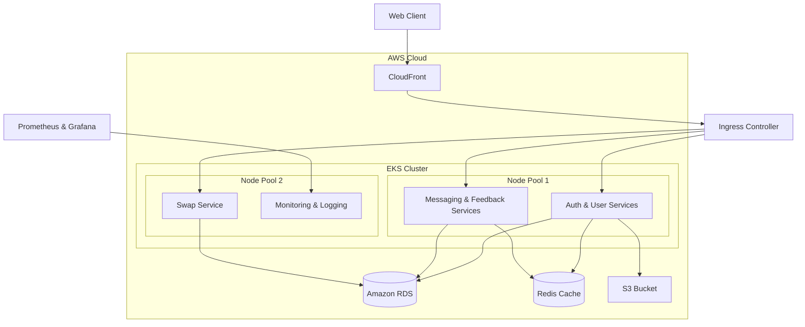
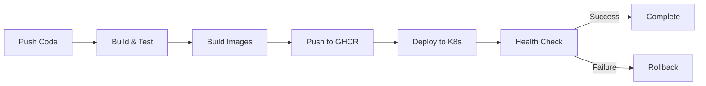

# SkillSwapper - DevOps & Microservices Platform

A modern, cloud-native microservices platform for skill exchange, built with comprehensive DevSecOps practices and deployed on AWS EKS.


[](https://github.com/Dhruvpatel50/devops-complete-project/security)

## Table of Contents
- [Project Overview](#project-overview)
- [System Architecture](#system-architecture)
- [Repository Structure](#repository-structure)
- [Microservices](#microservices)
- [Infrastructure Setup](#infrastructure-setup)
- [DevSecOps Pipeline](#devsecops-pipeline)
- [Deployment Guide](#deployment-guide)
- [Security Features](#security-features)

## Project Overview

SkillSwapper is a comprehensive platform that enables users to:
- Connect with other users to exchange skills
- Manage skill swap requests
- Real-time messaging between users
- Provide feedback and ratings
- Secure user authentication and profile management

## System Architecture

Our project implements a comprehensive DevSecOps pipeline to ensure security, code quality, and reliability throughout the development lifecycle.

### Security Scanning Tools

1. **Gitleaks**
   - Scans repository for hardcoded secrets and sensitive information
   - Prevents accidental commit of credentials
   - Generates SARIF reports for GitHub Security tab

2. **Snyk**
   - Continuous dependency vulnerability scanning
   - Container image security scanning
   - License compliance checking

3. **Trivy**
   - Container vulnerability scanning
   - Identifies vulnerabilities in container images
   - Checks for security issues in base images

### Code Quality Tools

1. **ESLint**
   - Static code analysis
   - Enforces code style and best practices
   - Security-focused rules enabled

2. **SonarCloud**
   - Code quality metrics
   - Security vulnerability detection
   - Code coverage tracking

### Dependency Management

1. **NPM Audit**
   - Continuous dependency scanning
   - Automatic security updates
   - Vulnerability reporting

### Pipeline Stages

1. **Security Scanning**
   - Secret detection
   - SAST (Static Application Security Testing)
   - License compliance

2. **Dependency Check**
   - Vulnerability scanning
   - Package auditing
   - Dependency updates

3. **Code Quality**
   - Linting
   - Style checking
   - Code smell detection

4. **Container Security**
   - Image scanning
   - Base image validation
   - Runtime security checks

### Continuous Monitoring

- Security scan results in GitHub Security tab
- Automated notifications for vulnerabilities
- Regular dependency updates
- Compliance reporting

## System Architecture

Our system architecture follows a modern microservices approach deployed on AWS EKS:



### Infrastructure Components:
- **EKS Cluster**: 2 worker nodes running microservices
- **Load Balancer**: AWS ALB for traffic distribution
- **Storage**: Amazon RDS for database, S3 for file storage
- **Caching**: Redis for session and data caching
- **CDN**: CloudFront for static content delivery
- **Monitoring**: Prometheus & Grafana stack

## Repository Structure

```
devops-complete-project/
├── services/                  # Microservices
│   ├── auth-service/         # Authentication service
│   ├── user-service/         # User management
│   ├── messaging-service/    # Real-time messaging
│   ├── swap-service/         # Skill swap management
│   └── feedback-service/     # User feedback & ratings
├── k8s/                      # Kubernetes manifests
│   ├── auth-service/
│   ├── feedback-service/
│   ├── messaging-service/
│   ├── swap-service/
│   └── ingress.yaml
├── infra/                    # Terraform configurations
│   ├── main.tf              # Main infrastructure
│   ├── variables.tf         # Variable definitions
│   └── outputs.tf           # Output definitions
├── .github/
│   └── workflows/           # CI/CD pipelines
└── scripts/                 # Deployment scripts
```

## Microservices

### 1. Auth Service
- User authentication and authorization
- JWT token management
- OAuth2 integration
- **Tech Stack**: Node.js, Express, JWT

### 2. User Service
- User profile management
- Skill inventory
- Account settings
- **Tech Stack**: Node.js, Express, MongoDB

### 3. Messaging Service
- Real-time chat functionality
- Message history
- User presence detection
- **Tech Stack**: Node.js, Socket.io, Redis

### 4. Swap Service
- Skill swap request management
- Matching algorithm
- Schedule coordination
- **Tech Stack**: Node.js, Express, MongoDB

### 5. Feedback Service
- User ratings and reviews
- Feedback management
- Rating analytics
- **Tech Stack**: Node.js, Express, MongoDB

## Infrastructure Setup

### AWS Resources
- EKS Cluster with 2 managed node groups
- VPC with public and private subnets
- NAT Gateway for private subnet access
- ALB for load balancing
- Route53 for DNS management

### Kubernetes Configuration
Example pod configuration:
```yaml
apiVersion: v1
kind: Pod
metadata:
  name: auth-service
spec:
  containers:
  - name: auth
    image: ghcr.io/dhruvpatel50/auth-service:latest
    ports:
    - containerPort: 3000
    resources:
      limits:
        memory: "512Mi"
        cpu: "500m"
      requests:
        memory: "256Mi"
        cpu: "250m"
```

## DevSecOps Pipeline

Our CI/CD pipeline implements comprehensive security scanning:

### Security Checks
1. **Secret Scanning**: Gitleaks
   - Prevents secret leaks
   - Custom rules for specific patterns
   - SARIF reporting

2. **SAST**: ESLint security rules
   - Code quality checks
   - Security best practices
   - Custom security rules

3. **Dependency Scanning**: Snyk
   - Vulnerability detection
   - License compliance
   - Dependency updates

4. **Container Scanning**: Trivy
   - Base image scanning
   - Package vulnerability checks
   - Misconfiguration detection

5. **Infrastructure Scanning**: Terraform security checks
   - IaC best practices
   - Security group validation
   - Access control verification

### CI/CD Flow
1. Code Push/PR → Security Scans
2. Build → Test → Security Scans
3. Container Build → Container Scan
4. Push to Registry
5. Deploy to EKS

### Security Reports
- All scan results available in GitHub Security tab
- Automated vulnerability reporting
- Compliance documentation
- Security metrics tracking

## Deployment Guide

1. **Prerequisites**
   ```bash
   aws configure
   kubectl configure
   terraform init
   ```

2. **Infrastructure Deployment**
   ```bash
   cd infra
   terraform plan
   terraform apply
   ```

3. **Application Deployment**
   ```bash
   kubectl apply -f k8s/
   ```

## Security Features

1. **Infrastructure Security**
   - Private subnets for workloads
   - Security groups and NACLs
   - IAM roles and policies
   - AWS KMS encryption

2. **Application Security**
   - JWT authentication
   - Rate limiting
   - Input validation
   - HTTPS enforcement

3. **Container Security**
   - Image scanning
   - Runtime security
   - Resource limits
   - Network policies

## Monitoring and Logging

1. **Metrics Collection**
   - Prometheus for metrics
   - Grafana for visualization
   - Custom dashboards

2. **Log Management**
   - Centralized logging
   - Log retention policies
   - Search and analytics

## Contributing

Please read our [Contributing Guide](CONTRIBUTING.md) for details on our code of conduct and the process for submitting pull requests.

## License

This project is licensed under the MIT License - see the [LICENSE](LICENSE) file for details.

1. **Auth Service** (Port: 3001)
   - Handles user authentication and authorization
   - JWT token management
   - User session management
   - AWS S3 integration for profile images

2. **User Service** (Port: 3002)
   - User profile management
   - User skills and preferences
   - Profile updates and settings

3. **Swap Service** (Port: 3003)
   - Skill swap request management
   - Matching algorithm
   - Swap status tracking
   - Scheduling coordination

4. **Messaging Service** (Port: 3004)
   - Real-time chat using WebSocket
   - Message history
   - Chat room management
   - Notification system

5. **Feedback Service** (Port: 3005)
   - User ratings and reviews
   - Feedback management
   - Rating analytics
   - Trust score calculation

### Tech Stack
- **Backend**: Node.js & Express.js
- **Database**: MongoDB
- **Message Broker**: MongoDB Change Streams
- **Container Runtime**: Docker
- **Container Orchestration**: Kubernetes (EKS)
- **CI/CD**: GitHub Actions
- **Cloud Provider**: AWS
- **Registry**: GitHub Container Registry (GHCR)

## CI/CD Pipeline

### Continuous Integration
1. **Build & Test** (Matrix Strategy)
   - Triggers on:
     - Push to main
     - Pull requests
     - Tag creation (v*)
   - Steps per service:
     - Checkout code
     - Setup Node.js
     - Install dependencies
     - Run tests
     - Security scanning

2. **Build & Push Images**
   - Builds Docker images for each service
   - Pushes to GitHub Container Registry
   - Tags with commit SHA and latest
   - Vulnerability scanning with Snyk

### Continuous Deployment
1. **Infrastructure Check**
   - Terraform validation
   - Infrastructure drift detection
   - AWS resource verification

2. **Deployment to Kubernetes**
   - EKS cluster deployment
   - Rolling updates
   - Health checks
   - Automatic rollback on failure



## Deployment Flow

### Production Deployment
1. **Infrastructure Setup**
   ```bash
   cd infra
   terraform init
   terraform apply
   ```

2. **Configure Kubernetes**
   ```bash
   aws eks update-kubeconfig --name devops-skillswapper --region us-east-1
   ```

3. **Deploy Services**
   ```bash
   kubectl apply -f k8s/
   ```

4. **Verify Deployment**
   ```bash
   kubectl get pods -A
   kubectl get services
   ```

### Monitoring & Logs
- Access Kubernetes Dashboard:
  ```bash
  kubectl proxy
  # Navigate to: http://localhost:8001/api/v1/namespaces/kubernetes-dashboard/services/https:kubernetes-dashboard:/proxy/
  ```

## Local Development

### Prerequisites
- Docker & Docker Compose
- Node.js (v18+)
- MongoDB
- AWS CLI
- kubectl

### Environment Setup
1. **Clone Repository**
   ```bash
   git clone https://github.com/Dhruvpatel50/devops-complete-project.git
   cd devops-complete-project
   ```

2. **Configure Environment**
   ```bash
   cp .env.example .env
   # Edit .env with your configurations
   ```

3. **Start Services (Development)**
   ```bash
   # Start all services with Docker Compose
   docker-compose up -d

   # Or start individual services
   cd services/auth-service
   npm install
   npm run dev
   ```

4. **Access Services**
   - Auth Service: http://localhost:3001
   - User Service: http://localhost:3002
   - Swap Service: http://localhost:3003
   - Messaging Service: http://localhost:3004
   - Feedback Service: http://localhost:3005

### Development Workflow
1. **Create Feature Branch**
   ```bash
   git checkout -b feature/your-feature
   ```

2. **Run Tests**
   ```bash
   # Run tests for all services
   ./scripts/test-all.sh

   # Or test individual service
   cd services/auth-service
   npm test
   ```

3. **Submit Changes**
   ```bash
   git commit -m "feat: your feature description"
   git push origin feature/your-feature
   ```

### Troubleshooting
- **Service Logs**
  ```bash
  # Docker Compose logs
  docker-compose logs -f [service_name]

  # Kubernetes logs
  kubectl logs -f deployment/[service_name]
  ```

- **Common Issues**
  1. Connection refused? Check if MongoDB is running
  2. Auth failed? Verify JWT_SECRET in .env
  3. S3 upload failed? Validate AWS credentials

## Security Considerations

### Production Deployment Checklist
- [ ] Set up AWS IAM roles with least privilege
- [ ] Configure network policies in Kubernetes
- [ ] Enable audit logging
- [ ] Set up monitoring and alerting
- [ ] Configure backup strategy
- [ ] Set resource quotas and limits
- [ ] Enable SSL/TLS
- [ ] Review security group rules

### Secret Management
- Use AWS Secrets Manager for production credentials
- Use Kubernetes secrets for sensitive data
- Never commit .env files with real credentials
- Rotate credentials regularly

## Contributing
1. Fork the repository
2. Create feature branch
3. Commit changes
4. Push to branch
5. Open pull request

## License
MIT License - see [LICENSE](LICENSE)

## Support
For support, email support@skillswapper.com or raise an issue in the repository.

## Project Structure

```
Skillswap/
  backend/    # Node.js/Express API server
  frontend/   # React client app
```

---

## Features
- User registration and authentication
- Profile creation and editing
- Skill offering and wanting
- Skill swap requests and management
- Dashboard and user search
- Modern, responsive UI with Tailwind CSS
- Toast notifications for feedback
- Landing page with About and Contact sections

---

## Prerequisites
- Node.js (v16 or higher recommended)
- npm (v8 or higher)
- MongoDB (local or cloud)

---

## Setup Instructions

### 1. Clone the repository
```bash
git clone https://github.com/PatelDharmik268/Skill_Swaper_oddooptimizer
cd Skillswap
```

### 2. Backend Setup
```bash
cd backend
npm install
# Create a .env file or edit env.txt with your MongoDB URI and JWT secret
# Example env.txt:
# PORT=5000
# MONGO_URI=mongodb://localhost:27017/skillswap
# JWT_SECRET=your_jwt_secret
npm start
```
- The backend will run on `http://localhost:5000` by default.

### 3. Frontend Setup
```bash
cd ../frontend
npm install
npm start
```
- The frontend will run on `http://localhost:3000` by default.

---

## Dependencies

### Backend
- express
- mongoose
- jsonwebtoken
- bcryptjs
- cors
- dotenv

### Frontend
- react
- react-router-dom
- react-toastify
- tailwindcss
- lucide-react

---

## Usage
- Visit `http://localhost:3000` to access the landing page.
- Register a new account or login.
- Create and edit your profile, list your skills, and browse other users.
- Send and manage skill swap requests.

---

## Customization
- To change the favicon/logo, replace `frontend/src/assets/logo.png` and update `frontend/public/index.html` as needed.
- To update backend environment variables, edit `backend/env.txt` or your `.env` file.

---

## License
This project is for educational and hackathon use. Please contact the authors for other uses. 
