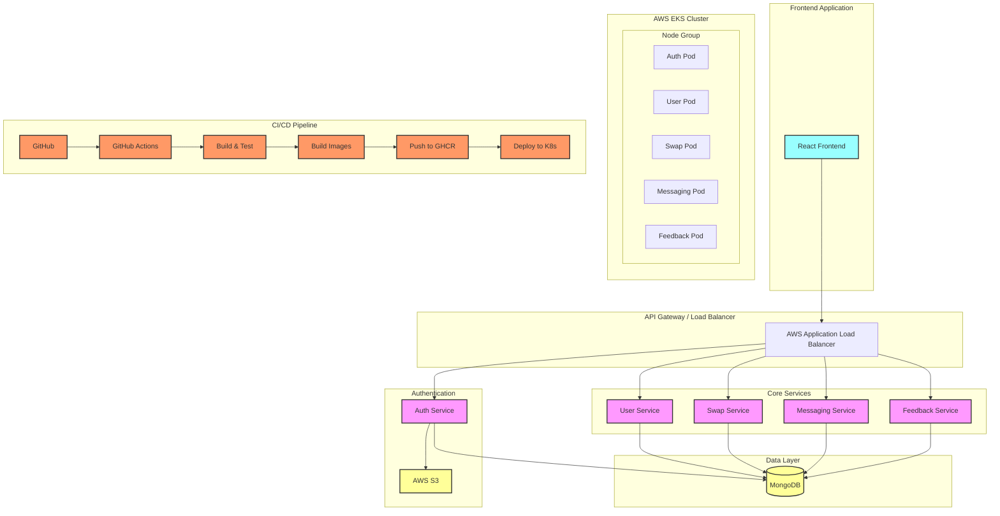

```mermaid
graph TB
    subgraph "Frontend Application"
        UI[React Frontend]
    end

    subgraph "API Gateway / Load Balancer"
        ALB[AWS Application Load Balancer]
    end

    subgraph "Authentication"
        Auth[Auth Service]
        S3[AWS S3]
    end

    subgraph "Core Services"
        User[User Service]
        Swap[Swap Service]
        Msg[Messaging Service]
        Feedback[Feedback Service]
    end

    subgraph "Data Layer"
        MongoDB[(MongoDB)]
    end

    UI --> ALB
    ALB --> Auth
    ALB --> User
    ALB --> Swap
    ALB --> Msg
    ALB --> Feedback

    Auth --> S3
    Auth --> MongoDB
    User --> MongoDB
    Swap --> MongoDB
    Msg --> MongoDB
    Feedback --> MongoDB

    subgraph "AWS EKS Cluster"
        direction TB
        subgraph "Node Group"
            Pod1[Auth Pod]
            Pod2[User Pod]
            Pod3[Swap Pod]
            Pod4[Messaging Pod]
            Pod5[Feedback Pod]
        end
    end

    subgraph "CI/CD Pipeline"
        direction LR
        Git[GitHub] --> Actions[GitHub Actions] 
        Actions --> Build[Build & Test]
        Build --> DockerBuild[Build Images]
        DockerBuild --> Push[Push to GHCR]
        Push --> Deploy[Deploy to K8s]
    end

    classDef service fill:#f9f,stroke:#333,stroke-width:2px
    classDef storage fill:#ff9,stroke:#333,stroke-width:2px
    classDef frontend fill:#9ff,stroke:#333,stroke-width:2px
    classDef pipeline fill:#f96,stroke:#333,stroke-width:2px

    class Auth,User,Swap,Msg,Feedback service
    class MongoDB,S3 storage
    class UI frontend
    class Git,Actions,Build,DockerBuild,Push,Deploy pipeline
```